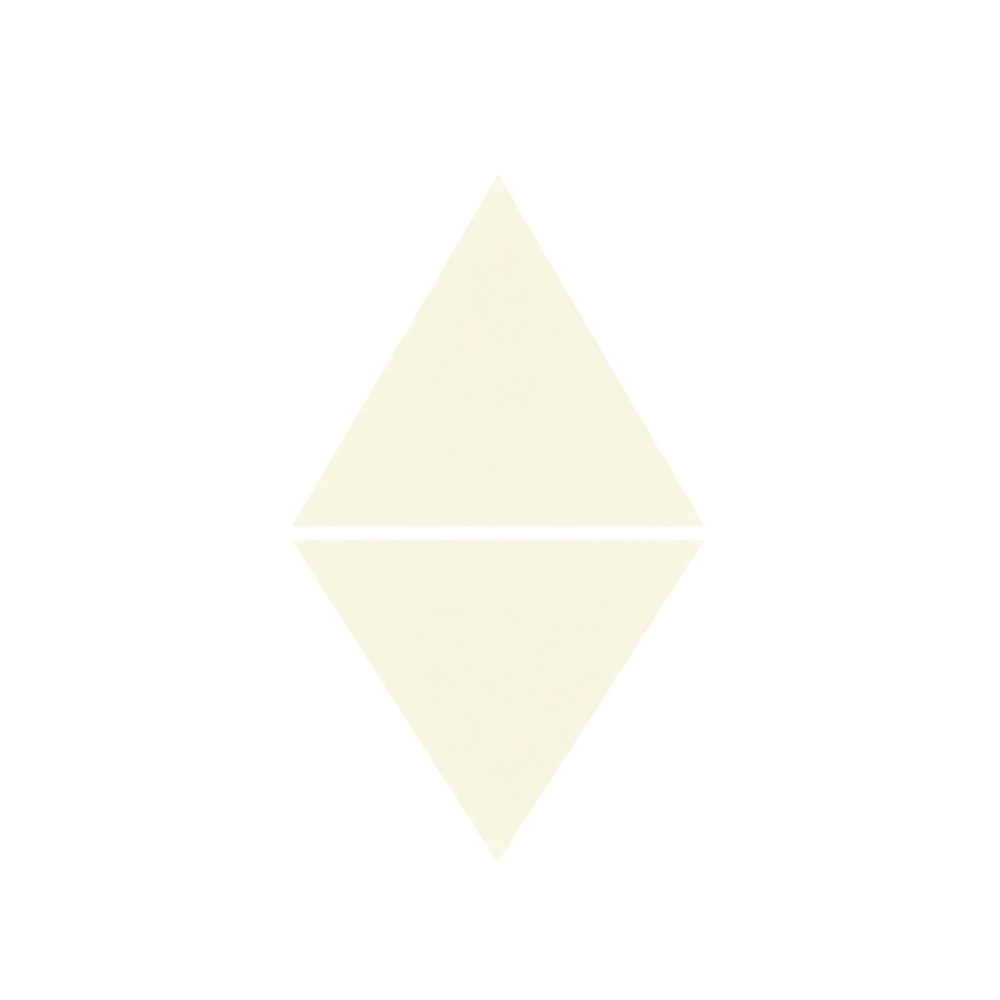

<div align="center">



# Inpriv

### Zero-knowledge. Client-side only.

**A suite of privacy-first web utilities engineered for total digital privacy.**

No trackers. No remote logs. No compromises — everything runs in your browser.

[](LICENSE)
[](https://inpriv.xyz)
[](https://inpriv.xyz)
[]()
[]()

 Quick links: [Website](https://inpriv.xyz) · [License](LICENSE) · [Security](SECURITY.md) · [Contributing](CONTRIBUTING.md)

</div>

---

##  Overview

Inpriv is an ecosystem of **zero-knowledge, fully client-side web utilities** — engineered so your sensitive data **never leaves your device**. No accounts, no servers, no telemetry, no log files. What happens in your browser, stays in your browser.

> **Why "zero-knowledge"?** Because the system — by design — holds *zero* knowledge about you. There is nothing to leak, nothing to subpoena, nothing to sell.

---

##  Live Tools

- **Hush** — [hush.best](https://hush.best) — E2E encrypted chat. Forward-secret rooms, QR sharing, zero metadata
- **Wipe** — [wipe.inpriv.xyz](https://wipe.inpriv.xyz) — metadata (EXIF/GPS) sanitizer for images
- **Compress** — [compress.inpriv.xyz](https://compress.inpriv.xyz) — image compression, no uploads
- **WebRTC Leak** — [webrtc.inpriv.xyz](https://webrtc.inpriv.xyz) — real-IP leak detection
- **Pay** — [pay.inpriv.xyz](https://pay.inpriv.xyz) — crypto payment bridge
- **Hash** — [hash.inpriv.xyz](https://hash.inpriv.xyz) — SHA & MD5 checksums, in-browser
- **DNS Leak** — [dns.inpriv.xyz](https://dns.inpriv.xyz) — DNS audit over DoH
- **QR** — [qr.inpriv.xyz](https://qr.inpriv.xyz) — generate & read QR codes, offline
- **Keyring** — [keyring.inpriv.xyz](https://keyring.inpriv.xyz) — zero-knowledge secret vault
- **IP Info** — [ipinfo.inpriv.xyz](https://ipinfo.inpriv.xyz) — what your browser reveals
- **Brute** — [brute.inpriv.xyz](https://brute.inpriv.xyz) — hash brute-force matcher
- **TOTP** — [totp.inpriv.xyz](https://totp.inpriv.xyz) — RFC 6238 authenticator, encrypted vault
- **Burn** — [burn.inpriv.xyz](https://burn.inpriv.xyz) — ephemeral encrypted notes, read-once

##  In Development

- **Mail** · **Zero** (wallet) · **OSINT** · **Hexa** · **Verdant**

---

##  Security

- **Key exchange** — Curve25519 (X25519 ECDH)
- **Encryption** — AES-256-GCM
- **Key derivation** — HKDF-SHA-256 + PBKDF2 (100k iterations)
- **Randomness** — Web Crypto API (`crypto.getRandomValues()`)
- **Transport** — TLS 1.3 (Hush signaling: `wss://`)
- **CSP** — `default-src 'self'`, `object-src 'none'`, `frame-src 'none'`

**Guarantees:** ✓ client-side only · ✓ forward secrecy · ✓ zero metadata · ✓ open source

---

##  Tech Stack

- **Frontend** — vanilla HTML/CSS/JS, Material Design 3 (earthy forest)
- **Crypto** — Web Crypto API, Curve25519
- **Hush signaling** — Python WebSocket server
- **Swift editor** — Rust
- **Edge** — Cloudflare (TLS, DDoS protection)

---

##  Getting Started

```bash
git clone https://github.com/salo-yek/inpriv.git
cd inpriv

# Serve locally (any static server works)
python -m http.server 8080
# → http://localhost:8080
```

Run your own Hush signaling relay:

```bash
cd .hush
pip install -r requirements.txt
python server.py
```

---

##  Project Structure

<details>
<summary>Click to expand — full monorepo layout</summary>

```
inpriv/
├── index.html          # Suite landing page (inpriv.xyz)
├── LICENSE             # MIT
├── .hush/              # E2E chat — web app + signaling server
├── .wipe/              # Metadata sanitizer
├── .compress/          # Image compression
├── .webrtc/            # WebRTC leak test
├── .pay/               # Crypto payment bridge
├── .hash/              # Checksum generator
├── .dns/               # DNS leak test (DoH)
├── .qr/                # QR generator/reader
├── .keyring/           # Encrypted secret vault
├── .ipinfo/            # Browser fingerprint inspector
├── .brute/             # Hash brute-force matcher
├── .zero/              # Crypto wallet (WIP)
├── .osint/             # OSINT engine (WIP)
├── .mail/              # Disposable email (WIP)
├── .totp/              # TOTP generator (WIP)
├── .hexa/              # In development
├── .verdant/           # In development
├── ..swift/            # inpriv-swift — Rust text editor
└── .cftcfg/            # Cloudflare Tunnel config manager
```

</details>

---

##  Roadmap

- [x] 13 core tools live on production
- [ ] PWA + offline support
- [ ] Zero wallet — security audit before release
- [ ] Mail — encrypted disposable email
- [ ] OSINT — AI-powered intelligence engine
- [ ] Security headers + SRI hardening
- [ ] i18n (PL/EN)

---

##  Contributing

See **[CONTRIBUTING.md](CONTRIBUTING.md)** for full guidelines.

1. **No malicious features** — modules enabling unauthorized access will be rejected
2. **Privacy by design** — nothing may ever phone home
3. Open an issue first for big changes
4. Follow the existing M3 design tokens

Found a security issue? See **[SECURITY.md](SECURITY.md)**.

---

##  License

MIT © 2026 [Aurex Labs](https://aurexlabs.xyz)

---

<div align="center">

 Built with love and paranoia — by **Aurex Labs**, independent studio

</div>
